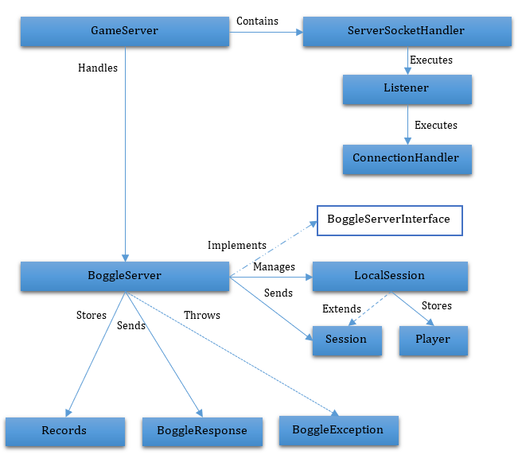

# Multiplayer Boggle Game Server

## About the Game
The system that was implemented is a variant of a word game called Boggle. However, in order to make the game more interesting and generate more race conditions in the server the rules of the original Boggle were modified in this implementation. The specific rules that were implemented are the following:
1. The game board consists of a 4 by 4 grid that contains a letter in each cell.
2. The objective of the game is to form as many words as possible using letters that are adjacent to each other.
3. Diagonally neighboring cells are considered to be adjacent to each other.
4. Only words of 3 or more letters can be used.
5. Each cell can be used only once in each word.
6. A game session will consist of three rounds of 1 minute each.
7. Users will submit words as they find them in the board and the game server will evaluate if a word is valid and if no other user has submitted it. If the word is valid and it has not been submitted before, the submitter will get the corresponding points. If it is a repeated word, the submitter will get points deducted from their total score. The number of points to be deducted will be calculated using the following formula:

n= −1 * s

Were n is the number of points that will be deducted and s is the number of times that the word has been submitted.
8. Points will be calculated based on the following table:

| Word length | Points |
| ----------- | ------ |
| 3, 4 | 1 |
| 5 | 2 |
| 6 | 3 |
| 7 | 5 |
| 8+ | 11 |

## About the System
### Server Description
The game server is in charge of creating game sessions, managing the players of each session, generating boards for each round in a session, and validating the words submitted by the players. The game server is capable of handling multiple sessions that happen simultaneously but are completely independent. For each session the server keeps a series of statistics that are displayed to the players after each round. Additionally, the server keeps track of server-wide historical statistics that are updated after a gaming session is completed.

The historical statistics that will be tracked by the server are:
- Best word ever played
- Highest score in one session
- Number of games completed
- Number of unique words submitted
- Number of repeated words submitted

The server is also capable of processing administrator commands that make it possible to save or load the records to and from the disk or to clear them if needed, restoring them to their initial default values.

Additionally, the server is able to handle clients that connect using an RMI service or that connect using traditional socket connections.

### Client Description
The boggle clients have a graphic user interface that allows them to easily interact with the server. The interface allows users to create new games by indicating a username and the number of users that will be taking part of the game session. The users will also have the option of joining a gamming session by simply indicating the session Id and sending the request to the server. Once a player has joined a game session, the server will wait until the minimum number of player has joined and until all of them have indicated that they are ready to start the game.

During each round the client will be used to submit words to the game server. After a round is over the client will display the sessions statistics to the players before setting up the next round. At the end of the session, the final statistics will be shown by the client.
## Server Technical Description
### Server State
- Sessions set: the server can have many game sessions going on at the same time and sessions can be created by any client, therefore it is a shared part of the state and needs to deal with potential concurrency issues. The set of sessions are stored in a ConcurrentHashMap in order to deal with any possible concurrent insertions, queries and removals. This hash map maps integers identifying each game session to their corresponding session. The sessions and all of their information are stored in instances of the LocalSession class in the boggle server. The integer that identifies each session is determined by a counter that is handled by the BoggleServer class, this counter is guarded by a lock in order to guarantee that each id will have a unique identifier.
- Statistics: the historical statistics are stored in an instance of the Records class. This class is thread safe in order to deal with the possible concurrency issues created by the multithreaded nature of the server. This class is serializable, so it allows server administrators to be able to save the records to disk before shutting down the server. The records can also be loaded from disk if the administrator requests it. The commands to make use of this functions will be listed in the description of the activities of the server.
- Sessions: there exists an object of type LocalSession for each game session that is active in the server. This class extend the Session class and is thread safe in order to guarantee that any concurrent operations are executed correctly. This class contains a hash map that keeps track of the player that have joined the session, this map maps strings representing the player’s username with objects of type Player. Additionally, the session objects store another hash map that stores the words that have been submitted during the session. This hash map maps each word to an integer that indicates how many times a word has been submitted. Each session also keeps track of session-level statistics and this are used to update the server-level statistics when the session is completed.
- Barriers: the server also keeps a ConcurrentHashMap object that maps between integer representing session identifiers and CyclicBarriers. These cyclic barriers are used to synchronize the start of each round of boggle and the finalization of a session in order to make sense that all the statistics are up to date before the server-side records are updated. Each cyclic barrier is initialized when a boggle session is created and is reset after every player has requested the start of each round or finalization of the session.
- Client specific state: the server keeps a client specific state in the Player objects that are created for each player. This objects store the player-specific statistics for each session, which are updated every time a user submits a new word to the boggle server.

### Activities
- Create session: this activity is executed when a client indicates that a new game session needs to be created. The new session will create a LocalSession object and add it to the set of sessions. The user will get a session code that can be shared with other players so that they can join the game. When this activity is executed the server will create a new game board and its solution.
- Join session: this activity is executed when a player requests to join a session by indicating the session identifier. A player will be able to join a game if there are open seats and if the username is available in the indicated
- Start round: a round will be started when all of the players have requested the start and the minimum number of players have joined the session. The minimum number of players for a session will be indicated by the creator of a session when the creation request is sent.
- Load dictionary: this activity is executed when the server is first created and loads the dictionary that will be used to solve the boards. The value of each word in the dictionary is calculated and store when the dictionary is being loaded.
- Validate submission: this activity is executed every time a client sends a word to the server. It takes or gives points to the user depending on the submission count of that word. The correctness of a word is checked in the client side before contacting the server in order to make the system more efficient.
- Get statistics: this activity is executed when a client requests the session statistics. It retrieves the player’s specific statistics so the GUI can be updated to display the most up to date information.
- Get session statistics: this activity is executed when a boggle round is completed. It serves as a synchronization point for the clients and retrieves the statistics of the session so it can be displayed in every client.
- Finalize session: this activity is executed when a session owner requests a session to be finalized (this is requested after all 3 rounds have been completed). This activity updates the server-wide records with the information of the recently finalized session.
- Administrator methods: the server has administrator methods that allow administrator users to query the status of the server and manage the server-wide records. The available administrator methods are:
	- Get active games: prints a list of the active boggle sessions and the list of users that joined each one of these sessions. This method can be called by typing “print status” into the server console.
	- Print records: prints the current server-wide records. The list of records available can be consulted in section number 2 of this document. This method can be executed by typing “print records” into the server console.
	- Save records: this method saves the current records into disk by serializing the current records object. It can be executed by typing “save records” in the server console.
	- Load records: loads a set of previously saved records into the server. The file were the records are saved is called server.records and contains a serialized version of the Records object that had been saved before. In order to call this method, the administrators need to type “load records” into the server console.
	- Clear records: this method will clear the current server records, setting them to their default initial values. It can be executed by typing “clear records” in the server console.

### Parallelism
In this system there can be multiple concurrency issues that need to be handled correctly, the main ones are discussed below:

- Creating a session: when a new session is being created there are two main concurrency issues that need to be handled. The first one is the assignation of the unique identifier to the session, this is handled by using a synchronized block that is guarded by an object that was created exclusively to serve as a guard for the integer that assigns the identified to new sessions. The second concurrency issue is the addition of a new session to the set of active sessions, the handling of this issue is delegated to the ConcurrentHashMap class.
- Joining a session: the operation that allows a player to join a game needs to be thread-safe in order to guarantee that the limit number of players will not be exceeded. Additionally, the username of the player is verified in order to make sure that it is unique in the boggle session. This concurrency issues are handled by the LocalSession class, which is thread safe thanks to the synchronization that exists in its methods.
- Finalizing a session: this operation can present concurrency issues because the session will be removed from the set of active sessions. This is handled by the ConcurrentHashMap, which guarantees that the state of the server will be correct when the operation is completed.
- Updating statistics: the process of updating the server-wide statistics needs to be thread safe in order to guarantee that the correct values get stored. This is because it is possible to have more than one session ending at the same time, so the update operation of session A could interfere with the update of session B if comparisons and variable assignments are not atomic. In order to handle this, the Record class was made thread safe by using synchronization in its methods.
- Saving, loading, clearing and querying statistics: this operation can present concurrency because it is possible that an administrator user will request any of this actions at the same time a session is being finalized. Like with the previous bullet point, the solution that was implemented is to synchronize the methods of the Records class.
- Starting a round: proper synchronization is needed when starting a round in order to be sure that all of the players have requested the start of the game. This is handled by using a CyclicBarrier for each session. The instances of this class control the flow of the execution of each game session, starting the game only after all the requests have been received.
- Validating a submission: multiple clients could submit the same words at the same time in the same game session, so the game server needs to be able to process the requests in the correct order so that the correct player gets the points for a new word. This will be possible by using synchronization blocks that guarantee the atomicity of the operations needed to validate a submission. This synchronization is included in the methods of the LocalSession class.

### Classes and Interfaces
The classes that were implemented and the relations between them are described below and can be consulted in the figure below.

- GameServer: this class is in charge of creating and handling the RMI registry and the socket connections used by client applications to connect to the boggle server.
	- ServerSocketHandler: This class handles socket connections received by the game server, it contains a thread pool that is used to process incoming requests from application clients.
		- Listener: This class implements the runnable interface and is in charge of scheduling a task for each incoming request. The tasks submitted by this class are executed by the thread pool executor of the server socket handler in order to send and receive information to and from the boggle server.
		- ConnectionHandler: This class is in charge of processing the individual requests that are received by the game server in its socket. It parses each incoming text request and translates it to a method call in the boggle server.
- BoggleServerInterface: this interface is used to execute RMI calls from the RMI clients. It is implemented by the BoggleServer class.
- BoggleServer: this class is in charge of handling all of the logic related with the game of boggle. It is used by many threads but delegates the handling of possible concurrent issues to other classes. It does contain some thread-safe data structures that store information about the sessions and help guarantee that the game logic will be maintained.
- Session: this class stores some information related to the boggle session that is being played by the user. This class implements the serializable interface because it is sent over to the application clients when a new session is created or the player joins an existing session. For the same reason it contains an overridden toString() method that creates a string version of the class that is used by socket-based clients. Although it is not really needed, this class is thread safe.
- LocalSession: this class extends the session class and is used by the server to perform session specific tasks, like getting the points that will be awarded or deducted to a user for submitting a word. This class is thread safe due to the fact that it can be concurrently accessed and utilized by many threads.
- Records: this class stores the server-wide records. It is thread-safe because it can be consulted and updated by many threads at the same time. This class implements the serializable interface in order to make it possible to serialize its contents to save and load them from and to disk.
- BoggleResponse: this class is serializable and is used to indicate clients the result of a word submission. It contains an overridden toString() method that creates a string version of the object that can be sent to the socket-based clients.
- Player: this class stores the information related to a single player. The class is serializable because it is sent over to client applications that used the RMI service.
- BoggleException: this is the type of exceptions that is returned by the boggle server.

## Client Technical Description
The client applications for this game are very simple and do not use complex algorithms or classes. The actions that will be available for a player are explained below.
Actions
- Create session: this creates a new game session by sending a request to the server. The server will send back a session id that can be used by other clients to join. The session id is sent in a session object or a string representation depending on the connection method used by the application.
- Join session: this is used by client applications to join an existing game session. The application sends a request to the server indicating the game session and, if the operation is successful, the server returns a session object or its string representation.
- Send start request: this sends the server a request to start a round. The game will start after all of the start requests are received by the server.
- Submit word: during the game the clients send words to be validated, the server will reply with a BoggleResponse object that will contain the points awarded by sending that word and other statistics for the player in the current session.
- Request statistics: this action is used in order to request the server to send the current rank, score and highest score of the round. This information is sent to the clients in a BoggleResponse object or its string representation.
- Finalize session: clients that own a session send this request to the server so that the server-wide records are updated with the session information and the session is removed from the active sessions set.
- Request session statistics: this requests the server to synchronize all the players of a session so that the statistics that are displayed by the GUI are updated with the most up to date information. This information is sent using a BoggleResponse object.

## Socket-based Service
The communication protocol that will be used by the socket-based service is simple due to the nature of the tasks that can be executed by the client applications.

The messages that are sent by the client to the server will consist of a series of fields separated using pipes (|). The first field will indicate the action that is being requested using a single digit with a value between 1 and 7. The rest of the fields will contain the information needed to execute the action requested.

The possible commands and the parameters needed to execute each command are listed in the following table:
Table 1: commands sent by application clients
VALUE
ACTION
PARAMETERS
1
Create a new session
Maximum number of players, username
2
Request round start
Session ID
3
Submit word
Session ID, username, word
4
Request statistics
Session ID, username
5
Finalize session
Session ID
6
Join session
Session ID, username
7
Request session statistics
Session ID, username
The messages that are sent as replies by the server have a similar structure. The first value indicates the type of answer that was sent, while the rest of the values will contain information related to the request that was received.
The possible request that are sent by the server are listed below:
Table 2: responses sent by the game server
VALUE
RESPONSE TYPE
INFORMATION RECEIVED
1
String version of Session object
Session ID, game board with each cell separated by commas, list of words in the board solution separated by commas
2
String version of BoggleResponse object
Awarded points, player score, current high score, player ranking
3
Simple string
Confirmation or error message
Below an example of how the communication is conducted can be consulted:
Table 3: example communication between server and socket-based clients
Action
Message
Join session
Client message: 6|2|eccar950
Server response: 1|2|S S T P,R E H G,D Y R W,U U B P|,dur,prey,yerd,wrest,burgher,gryde,…
Request round start
Client message: 2|2
Server response: Command processed
Request statistics
Client message: 4|2|eccar950
Server response: 0|0|0|1
Estuardo Carpio - erp48
7 / 8
Request session statistics
Client message: 7|3|eccar950
Server response: 0|0|0|1
In order to create a socket-based client the BoggleClient application has to be ran indicating an IP and port number in the following way: -xxx.xxx.xxx:yyyyy. Where the – indicates that a socket will be used, the x’s represent the IP number and the y’s the port number.
6 RMI-based Service
In order to make use of the RMI interface the clients create a stub of the BoggleServerInterface. The methods that exist in this interface and its parameters are described below:
 createSession(int numPlayers, String playerName): will create a new game session and return a Session object containing the session information.
 joinSession(int sessionId, String playerName): will join the session if more players are still required and the username is unique. Returns the Session object.
 requestStart(int sessionId): indicates that the player is ready to start the game. The server will start the game round when all the start requests have been received.
 submitWord(int sessionId, String playerName, String word): submits a word for validation and return the output of the process in a BoggleResponse object.
 getStatistics(int sessionId, String playerName): asks the server to send the current round statistics for a given player, this information is sent in a BoggleResponse object.
 finalizeSession(int sessionId): this method asks the server to remove a session from the active sessions and verify if a record was broken.
 getSessionStatistics(int sessionId, String playerName): asks the server to wait until all player have requested the statistics in order to return the most up to date statistics to each user. The information is returned in a BoggleResponse object.
The Session or BoggleResponse objects received by the clients are then processed in order to update the GUI or control de game flow depending on the result of the request sent to the game server.
In order to create an RMI-based client the BoggleClient application has to be ran indicating an IP and port number in the following way: xxx.xxx.xxx:yyyyy. Where the x’s represent the IP number and the y’s the port number.
7 Ghost Clients
This type of clients was created in order to simulate high demand on the server services. They connect to the server by using the RMI interface and receive a configuration parameter that determines the frequency with which the submit words to the server. In order to use this type of clients the BoggleClient application needs to be run with the following parameters:
xxx.xxx.xxx:yyyyy t
Where xxx.xxx.xxx.xxx is an IP address, yyyyy is a port number and t is a number between 1 and 5 that will determine the frequency of submissions made by the ghost (1 sends a request each second, 5 one each 5 seconds). An example of the needed parameters would be: 192.168.56.1:56034 1
In figure 2 the different type of clients and their connection methods can be consulted. In this figure the thread safe classes are colored with green and the GameServer and BoggleServer classes are abstracted into a single class to make the diagram easier to analyze.
Estuardo Carpio - erp48
8 / 8
Figure 2: general components diagram for the boggle server-client system
8 Test Cases
In order to test the correctness of the system when dealing with high demand the following test cases were tested:
 Creating a session: a simple test class was set up to send multiple session creation requests simultaneously. After the requests had been sent the contents of the ConcurrentHashMap that stores the active sessions were consulted to verify that all the sessions had been created and that the unique identifiers assigned to each one of the were in fact unique.
 Joining a session: to test this concurrency issue a game session that allowed 1000 players was created. Additionally, 2000 simple classes were set to send join requests to that same game session. After the test was completed it was verified that only 1000 players had been added to the HashMap that contains the players in the session.
 Updating, saving, loading, clearing and querying statistics: this was tested by creating many different sessions and setting up ghost players to play against each other. After each round was over the statistics were consulted and compared with the words submitted by the ghosts in order to verify that the records had been updated correctly.
 Starting a round: this was validated as a part of the test described previously. It was verified by making sure that every round started after all the ghosts had requested the start (which was made manually) and verifying that every round concluded at the same time for every ghost.
 Validating a submission: in order to validate this three simple test classes where set up to send a list of words in the same order, at the same time. After the execution was over it was verified that every words had been submitted three times and that only one of the dummy clients had been granted points, while the other two had had theirs deducted.